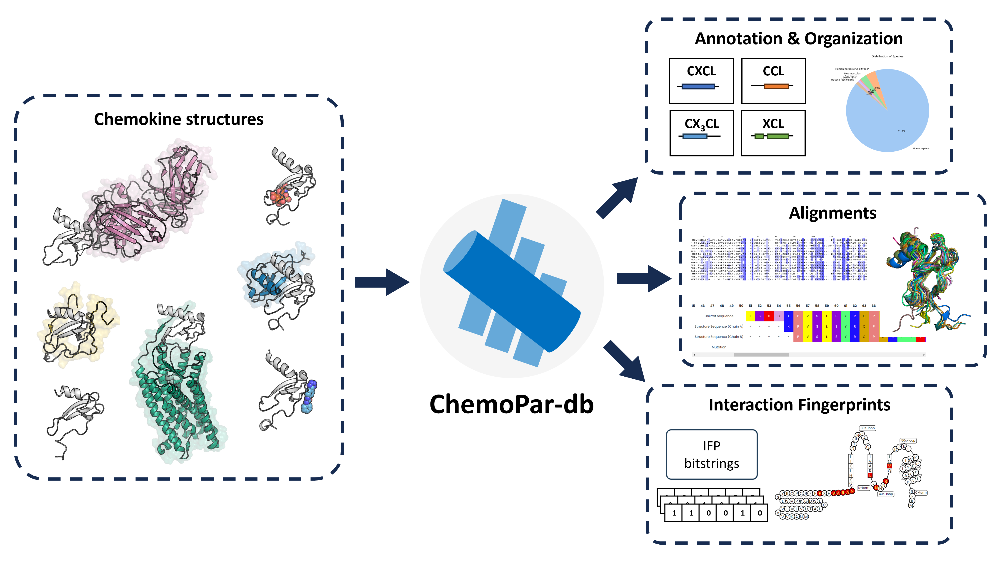

# ChemoPar-db

  

## Description

**ChemoPar-db** (chemokine partner database) is a specialized structural protein database designed to catalog and analyze chemokine structures and their interactions with various binding partners. Chemokines are crucial to immune system function, mediating cell communication, inflammation, and immune responses through complex interaction networks. ChemoPar-db compiles and annotates over 230 chemokine structures, providing detailed molecular interaction fingerprints to enable researchers to explore the diverse binding mechanisms of chemokines. This freely accessible, user-friendly platform supports bioinformatics and cheminformatics research, offering insights into the chemokine signaling axis to further drug discovery and therapeutic research.

# Table of contents

- [ChemoPar-db](#chemopar-db)
  - [Description](#description)
- [Table of contents](#table-of-contents)
- [Getting started](#getting-started)

## Getting Started

### Requirements
- **Python** 3.8+
- **Virtualenv**

### Running a Local Database (SQLite3)
...

### Running Production Database (PostgreSQL)
- **PostgreSQL** 12+

...

### Build Command Order
To build the database step-by-step, run the build commands located in the `ChemoPar/build/management/commands` directory in the following order:

1. `clear_cache`
2. `build_common`
3. `build_proteins`
5. `build_structures`
