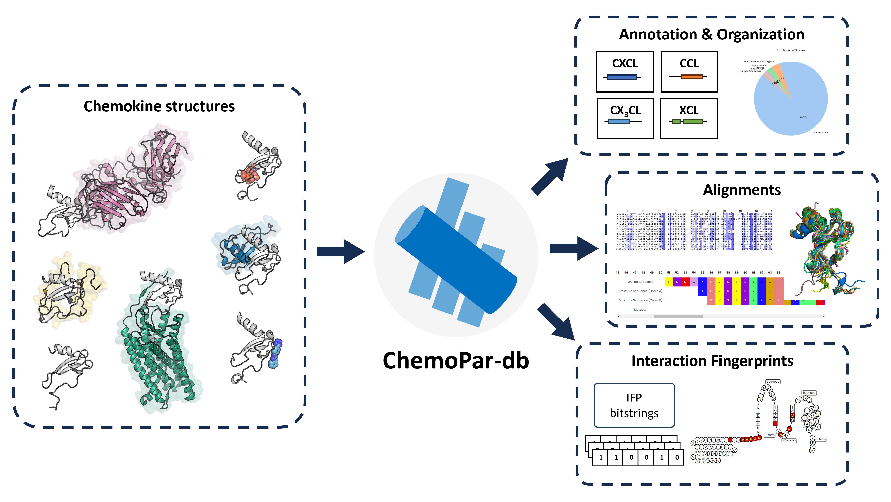

# ChemoPar-db

<p align="center">
  
  <br/>
  <em>A structural chemogenomics database for chemokines and their binding partners</em>
  <br/>
  <a href="https://chemopar-db.net/" target="_blank">chemopar-db.net</a>
  ·
  <a href="#citing">Cite</a>
</p>

## Overview

ChemoPar-db is a specialized structural protein database for cataloging chemokine structures and their interactions with diverse binding partners (GPCRs, glycosaminoglycans, antibodies, and more). It aggregates experimental structures, predicted models, and rich interaction fingerprints to support exploration of chemokine binding mechanisms and hypothesis generation for drug discovery.

Highlights:
- Curated chemokine structures with chain/entity metadata
- Interaction fingerprints and partner summaries
- Predicted models (e.g., AlphaFold) and predicted complexes
- Modern browser with per-entry details and 3D viewer

## Getting Started

### Requirements
- Python 3.8+
- pip / virtualenv (or conda)
- Optional: PostgreSQL 12+ for production-like setups (SQLite works locally)

### Quickstart (local, SQLite)
```
git clone <this-repo>
cd chemopar_public
python -m venv venv
source venv/bin/activate  # Windows: venv\Scripts\activate
pip install -r requirements.txt

python manage.py migrate
python manage.py runserver
```
Open http://127.0.0.1:8000/ in your browser.

### Populate Data
Management commands live in `build/management/commands/`.

Typical sequence:
- Common references and resources
  - `python manage.py build_common`
- Proteins (families, sequences, residues, signal peptides)
  - `python manage.py build_proteins`
- Experimental structures and entities
  - `python manage.py build_structures`
- Predicted chemokine structures from AlphaFold (new)
  - `python manage.py build_alphafold_models`


### Useful Paths
- App templates: `structure/templates/structure/`
- Views and URLs: `structure/views.py`, `structure/urls.py`
- Models: `structure/models.py`, `protein/models.py`

## Development
- Run tests or basic checks as needed
- Keep style consistent; static styles live in `static/style.css`
- For the 3D viewer, we use NGL; see predicted and structure detail templates for examples

## Citing
If you use ChemoPar-db in your work, please cite:

ChemoPar-db: a structural chemogenomics database for chemokines and their binding partners; https://chemopar-db.net/; 2025; Bas de Boer, Albert J. Kooistra, Iwan J.P. de Esch, Barbara A. Zarzycka.

Suggested BibTeX
```
@misc{chemopar_db_2025,
  title        = {ChemoPar-db: a structural chemogenomics database for chemokines and their binding partners},
  howpublished = {\url{https://chemopar-db.net/}},
  year         = {2025},
  author       = {de Boer, Bas and Kooistra, Albert J. and de Esch, Iwan J.P. and Zarzycka, Barbara A.}
}
```

## License
Licensed under the Apache License, Version 2.0. See the `LICENSE` file for details.

## Acknowledgements
We gratefully acknowledge the open-source efforts of the following resources, which have informed parts of this work and its implementation patterns:

<ul>
<li>GPCRdb (https://github.com/protwis/protwis/tree/master)</li>
<li> SH2db (https://github.com/keserulab/SH2db)</li>
</ul>